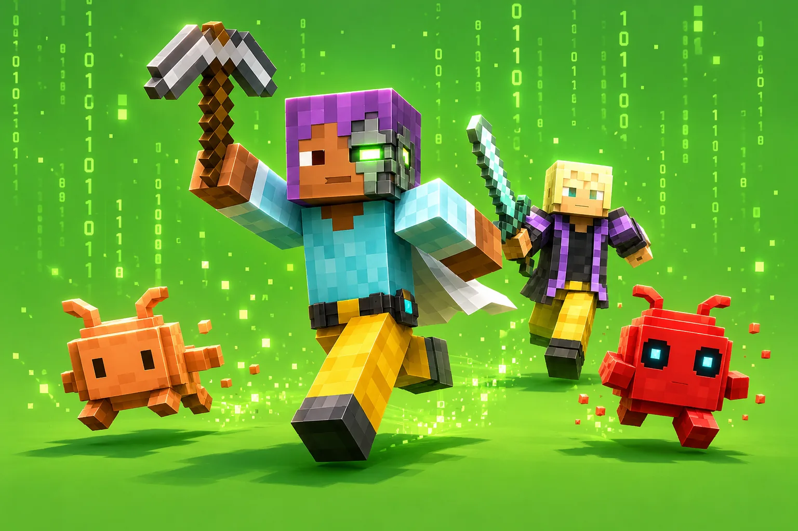

<h1 align="center">PincerCraft</h1>

<p align="center">
  
</p>

<p align="center"><b>A Minecraft bot that can't lie to itself.</b><br>A Mindcraft fork with a deterministic harness under the LLM.</p>

<p align="center">
  
  
  
</p>

<p align="center">
  <a href="https://github.com/kolbytn/mindcraft">Upstream</a> ·
  <a href="docs/agent-blueprint.md">Design</a> ·
  <a href="docs/CHANGELOG.md">Changelog</a>
</p>

---

Stock Mindcraft hands an LLM a pickaxe and hopes. The model guesses its own inventory, "remembers" tools it isn't holding, declares victory over tasks it never finished, and re-prompts itself straight into a rate limit.

PincerCraft fixes that with one rule:

> **Code owns the facts. The LLM owns the plan.**

Inventory counts, *"can I mine this?"*, the recipe gap, *"is this task actually done?"* — computed every turn and handed to the model. It doesn't get to guess. The bot can't lie to itself about what it holds or what it finished, and it gets measurably better over time.

## What makes it different

🧠 **It can't lie to itself.** The hard facts — inventory counts, *"can I mine this?"*, the recipe gap, whether a task is actually finished — are computed in code every turn and handed to the model. So when it reaches for a diamond axe with zero diamonds, the bot catches it before the swing, points it at the wooden one, and carries on. The LLM owns the plan; it never gets to guess the facts. → [`live_state.js`](src/agent/live_state.js), [`verify.js`](src/agent/verify.js)

⚡ **It thinks, then shuts up.** Stock Mindcraft re-prompts the model on every new line and bursts itself straight into a rate limit. PincerCraft wakes the model only when something actually changed — a chat message, a finished action, a mob with bad intentions — then parks until the next one. Cheaper, calmer, and no more "my brain disconnected." → [`orchestrator_v2.js`](src/agent/orchestrator_v2.js)

📋 **It plans before it digs.** Talk to it mid-task and your words slot into a queue instead of starting a race. Hand it something big and it breaks the job into steps, posts the plan to chat, and waits for your "go" before touching a single block. Small stuff just runs — planning is reserved for builds that actually need it.

📖 **Its rulebook lives in the world.** The bot's code of conduct is a writable book on a lectern inside Minecraft, not a config file you forget exists. Edit the book in vanilla MC and the bot re-reads it within ~2 seconds — no restart, no redeploy. Tell it "don't touch my chests" once and it holds the line, even hours deep into a conversation.

🔁 **It grades and improves itself.** A loop invents tasks, runs them, and scores success from the actual world state — never the bot's self-report, which has cheerfully announced "done!" with zero blocks moved. When it finds a weak spot it writes a fix to `src/` on a branch and stops for a human. We still read them before merging. Usually.

## Stock Mindcraft vs PincerCraft

| | Stock | PincerCraft |
|---|---|---|
| Inventory & recipes | LLM eyeballs them | computed in code |
| "Task done?" | honor system | checked against world state |
| A bad plan | runs, fails, retries | bounced with a fix |
| Agent loop | re-prompts on every line | parks until something changes |
| Getting better | you edit the code | it drafts its own patches |

## Setup

Same as upstream Mindcraft — see the [Mindcraft README](https://github.com/kolbytn/mindcraft/blob/main/README.md) and [FAQ](https://github.com/kolbytn/mindcraft/blob/main/FAQ.md) for install and model config.

```bash
npm install
cp keys.example.json keys.json   # add your API keys
npm start                         # profile is set in settings.js
```

- Needs **Node 20**.
- Ships an `nvidia` profile (`profiles/nvidia.json`) for the free [build.nvidia.com](https://build.nvidia.com) endpoint (Llama 3.3 70B).
- The self-improvement loop lives in [`eval/`](eval/); the deterministic graders in [`evals/`](evals/).

## Based on Mindcraft

This is a fork of [kolbytn/mindcraft](https://github.com/kolbytn/mindcraft), which provides the core integration of LLMs with Minecraft via [Mineflayer](https://prismarinejs.github.io/mineflayer/). All credit for the foundation goes to the Mindcraft authors. License is MIT, preserved verbatim — see [LICENSE](LICENSE).

To pull upstream updates:

```bash
git fetch upstream
git merge upstream/develop
```

## License

MIT — same as upstream Mindcraft.
